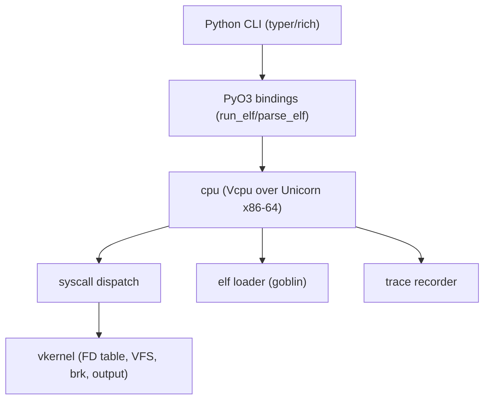

# Architecture

winVpwn follows a five-layer design. 0.2 implements a virtual kernel on top of
the Stage 1 execution loop: static `ET_EXEC` x86_64 ELF images with stdio,
explicit VFS maps, and brk/mmap.

## Layer overview

### 1. `elf` — image parsing

`elf::loader::load_elf` parses the image with goblin and validates it:

- magic bytes, 64-bit little-endian, `EM_X86_64`
- `ET_EXEC` only (`ET_DYN`/PIE returns error `E004`)
- every `PT_LOAD` segment is within the file; segments must not overlap

It produces `LoadedElf` with the entry point and a list of `Segment`s.

### 2. `cpu` — emulation loop

`cpu::unicorn_engine::Vcpu` owns a Unicorn engine and:

- maps the loaded segments with their page permissions
- maps a guest stack and installs a Linux argv/envp/auxv layout
- installs an `add_insn_sys_hook` for the `syscall` instruction
- keeps `KernelState` across syscalls (FDs, VFS, stdin, brk)
- runs until exit, an unmapped page fetch (falloff), or a timeout

The hook reads the syscall ABI registers, builds a `SyscallRegs`, dispatches
against the persistent kernel, and writes the result back to `rax`.

### 3. `syscall` — translation

`syscall::Dispatch` routes Linux x86_64 syscall numbers to handlers.

I/O: `read`, `write`, `open`/`openat`, `close`, `lseek`, `stat`/`fstat`/`lstat`/`newfstatat`,
`pread64`/`pwrite64`, `readv`/`writev`, `dup`/`dup2`/`fcntl`.

Memory: `brk`, `mmap`, `mprotect`, `munmap`.

Process: `exit`/`exit_group`, `getpid`/`gettid`/`getuid`/`getgid`, `arch_prctl`,
`uname`, `getcwd`/`chdir`, `clock_gettime`/`gettimeofday`/`time`/`getrandom`.

Unknown numbers return `-ENOSYS` and are recorded in the trace.

`write` to fd 1/2 appends to an in-memory `OutputCapture`. Writes to a VFS file
stay in the VFS; host files are updated only for `--map …:rw` after the guest
exits.

### 4. `vkernel` — virtual process

`KernelState` is the per-process view: FD table, VFS, stdin buffer, cwd, brk,
uid/gid, and captured output. `GuestMemory` is either in-memory (tests) or
Unicorn-backed (execution). Handlers talk only to this abstraction.

### 5. `memory` — address space bookkeeping

`memory::mmap::MemoryMap` tracks claimed guest regions and rejects overlaps.
It is pure guest-space bookkeeping; it grants no host access.

## Python side

- `winvpwn.cli` — Typer CLI: `doctor`, `run`, `elf`, `asm`, `disasm`, `version`
- `winvpwn.ui` — rich helpers (low-saturation theme, rounded tables)
- `winvpwn.toolchain` — capstone/keystone wrappers for `asm`/`disasm`
- `winvpwn_core` — PyO3 extension exposing `run_elf` and `parse_elf`

`run_elf` accepts `stdin`, `argv`, `env`, `maps` (`guest, host, writable`), and `cwd`.

## Error codes

Errors carry stable machine-readable codes used by the CLI and audit logs:

| code | meaning                                       |
| ---- | --------------------------------------------- |
| E001 | not an ELF (bad magic)                        |
| E002 | unsupported image format (e.g. 32-bit)        |
| E003 | unsupported machine                           |
| E004 | unsupported ELF type (e.g. PIE)               |
| E005 | malformed program header                      |
| E006 | truncated image                               |
| E007 | overlapping loadable segments                 |
| E101 | guest address-space overlap                   |
| E201 | syscall handler mismatch                      |
| E202 | engine error while reading guest state        |
| E301 | virtual kernel map failure                    |
| E302 | invalid process state                         |
| E401 | guest memory access failed                    |
| E501 | emulator initialization failed                |
| E502 | guest region mapping failed                   |
| E503 | register/memory operation failed              |
| E504 | execution error                               |
| E505 | image not loaded                              |
