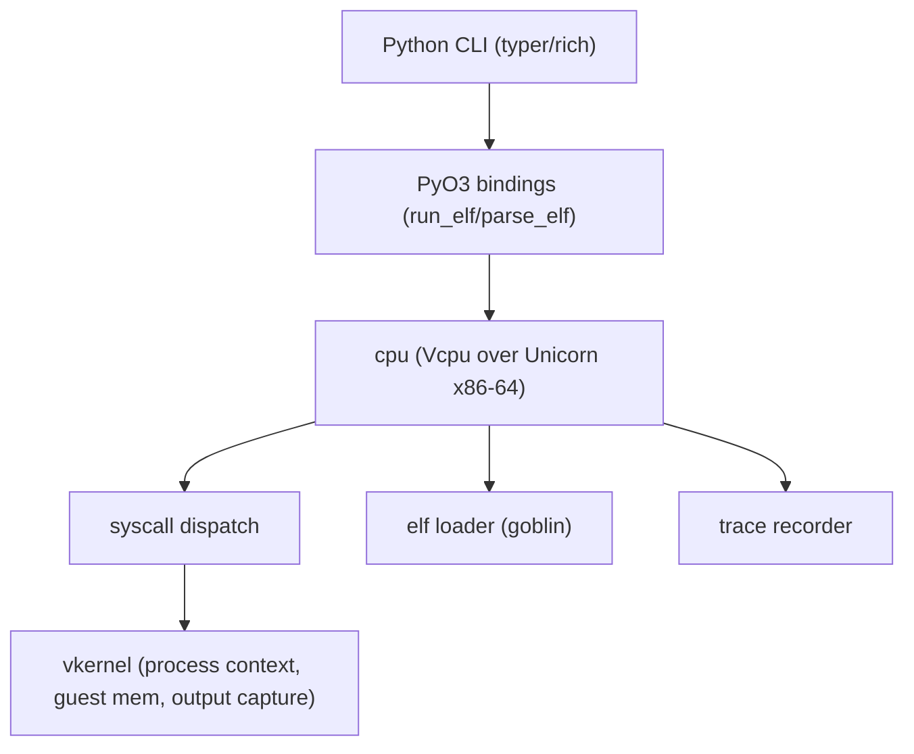

# Architecture

winVpwn follows a five-layer design. Stage 1 implements the minimal subset
needed to load and run a static `ET_EXEC` x86_64 ELF that only uses `write`,
`exit`, and `exit_group`.

## Layer overview

### 1. `elf` — image parsing

`elf::loader::load_elf` parses the image with goblin and validates it:

- magic bytes, 64-bit little-endian, `EM_X86_64`
- `ET_EXEC` only in stage 1 (`ET_DYN`/PIE returns error `E004`)
- every `PT_LOAD` segment is within the file; segments must not overlap

It produces `LoadedElf` with the entry point and a list of `Segment`s.

### 2. `cpu` — emulation loop

`cpu::unicorn_engine::Vcpu` owns a Unicorn engine and:

- maps the loaded segments with their page permissions
- maps a guest stack and installs a Linux-style argv/envp layout
- installs an `add_insn_sys_hook` for the `syscall` instruction
- runs until exit, an unmapped page fetch (falloff), or a timeout

The hook reads the syscall ABI registers, builds a `SyscallRegs`, dispatches,
and writes the result back to `rax`.

### 3. `syscall` — translation

`syscall::Dispatch` routes Linux x86_64 syscall numbers to handlers. Stage 1:

| nr | name        | behavior                                            |
| -- | ----------- | --------------------------------------------------- |
| 1  | `write`     | capture to the virtual process output buffer        |
| 60 | `exit`      | set exit code and stop emulation                    |
| 231| `exit_group`| same as `exit` for stage 1 (single thread)          |
| *  | (unhandled) | returns `-ENOSYS` and is recorded in the trace      |

`write` never touches a host descriptor: bytes are appended to an in-memory
`OutputCapture` owned by the virtual process.

### 4. `vkernel` — virtual process

`vkernel::Context` is the per-syscall view: process state, a `GuestMemory`
backend (in-memory for tests, Unicorn-backed during execution), and the
captured output.

### 5. `memory` — address space bookkeeping

`memory::mmap::MemoryMap` tracks claimed guest regions and rejects overlaps.
It is pure guest-space bookkeeping; it grants no host access.

## Python side

- `winvpwn.cli` — Typer CLI: `doctor`, `run`, `elf`, `asm`, `disasm`, `version`
- `winvpwn.ui` — rich helpers (low-saturation theme, rounded tables, static
  progress with no rotating glyphs)
- `winvpwn.toolchain` — capstone/keystone wrappers for `asm`/`disasm`
- `winvpwn_core` — the PyO3 extension exposing `run_elf` and `parse_elf`

## Error codes

Errors carry stable machine-readable codes used by the CLI and audit logs:

| code | meaning                                       |
| ---- | --------------------------------------------- |
| E001 | not an ELF (bad magic)                        |
| E002 | unsupported image format (e.g. 32-bit)        |
| E003 | unsupported machine                           |
| E004 | unsupported ELF type (e.g. PIE in stage 1)    |
| E005 | malformed program header                      |
| E006 | truncated image                               |
| E007 | overlapping loadable segments                 |
| E101 | guest address-space overlap                   |
| E201 | syscall handler mismatch                      |
| E202 | engine error while reading guest state        |
| E301 | virtual kernel map failure                    |
| E302 | invalid process state                         |
| E401 | guest memory access failed                    |
| E501 | emulator initialization failed                |
| E502 | guest region mapping failed                   |
| E503 | register/memory operation failed              |
| E504 | execution error                               |
| E505 | image not loaded                              |
